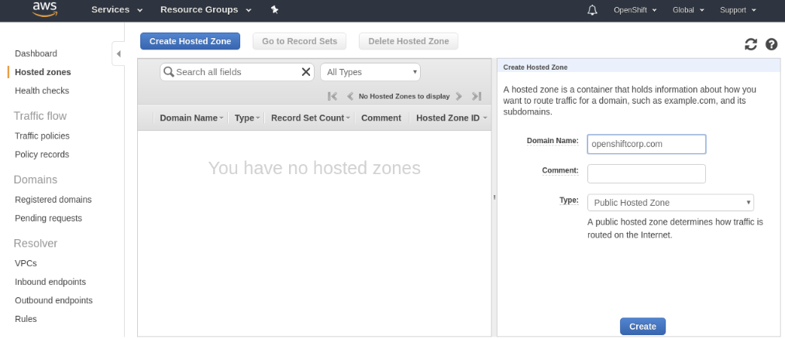

# Route53

Amazon's Route53 service is used by the OpenShift installer to configure cluster DNS resolution and provide name lookup
for the cluster to the outside world. To use OpenShift, you must have created a public hosted zone in Amazon Route53 in
the same account as your OpenShift cluster. You must also ensure the zone is "authoritative" for the domain. There are
two ways to do this outlined below: root domain and subdomain. A root domain is "openshiftcorp.com". A subdomain is of
the form "clusters.openshiftcorp.com".

The below sections identify how to ensure your hosted zone is authoritative for a domain.

## Step 1: Acquire/Identify Domain

You may skip this step if using an existing domain and registrar. You will move the authoritative DNS to Route53 or
submit a delegation request for a subdomain in a later step.

Route53 can also purchase domains for you and act as a registrar. If you allow Route53 to purchase a new domain for you,
you can skip the remainder of these steps (the domain is created and the hosted zone is created correctly for you)!

### Example: Purchasing a new domain


Later:


## Step 2: Create Public Hosted Zone

Whether using a root domain or a subdomain, you must create a public, hosted zone.

[AWS: Creating a Public Hosted Zone][create-hosted-zone]

To use the root domain, you'd create the hosted zone with the value "openshiftcorp.com". To use a subdomain, you'd
create a hosted zone with the value "clusters.openshiftcorp.com". (Use appropriate domain values for your situation.)

### Example: Root Domain



## Step 3: Get Public Nameservers of Hosted Zone

For either a root domain "openshiftcorp.com" or a subdomain "clusters.openshiftcorp.com", you must extract the new
authoritative nameservers from the hosted zone records.

[AWS: Getting the Name Servers for a Public Hosted Zone][get-hosted-zone-info]

### Example: Root Domain


## Step 4a: Root Domain - Update Registrar

Each registrar requires a slightly different procedure. Using the four nameserver values from the previous step,
you will update the registrar records to the AWS Route53 nameservers.

If you have previously registered your root domain with AWS Route53 (in another account), you can follow the procedure
here:

[AWS: Adding or Changing Name Servers or Glue Records][set-glue-records]

If you are migrating your root domain to Route53, care should be taken to migrate any existing DNS records first:

[AWS: Making Amazon Route 53 the DNS Service for an Existing Domain][migrate-dns]

### Example


## Step 4b: Subdomain - Perform DNS Delegation

For a subdomain of openshiftcorp.com (e.g. clusters.openshiftcorp.com), you must add delegation records to the
parent/root domain. This may require a request to your company's IT department or the division which controls the root
domain and DNS services for your company.

### Example: BIND

Delegation records in the root domain for openshiftcorp.com to AWS Route53 for the subdomain of
clusters.openshiftcorp.com would take the following form:

```
$ORIGIN clusters.openshiftcorp.com.
	IN 	NS	ns-124.awsdns-15.com.
	IN	NS	ns-1062.awsdns-04.org.
	IN	NS	ns-1603.awsdns-08.co.uk.
	IN	NS	ns-972.awsdns-57.net.
```

### Example: Route53

Following our previous example, if using entirely AWS Route 53 for the registrar, root domain and subdomain, the root
domain (openshiftcorp.com) hosted zone would look like the following:


The root domain would contain the authoritative information for the root domain and also identify a separate set of
nameservers for the subdomain (the nameservers for a separate Hosted Zone in Route53)

The hosted zone of the subdomain (clusters.openshiftcorp.com) would show:


[create-hosted-zone]: https://docs.aws.amazon.com/Route53/latest/DeveloperGuide/CreatingHostedZone.html
[get-hosted-zone-info]: https://docs.aws.amazon.com/Route53/latest/DeveloperGuide/GetInfoAboutHostedZone.html
[set-glue-records]: https://docs.aws.amazon.com/Route53/latest/DeveloperGuide/domain-name-servers-glue-records.html#domain-name-servers-glue-records-procedure
[migrate-dns]: https://docs.aws.amazon.com/Route53/latest/DeveloperGuide/MigratingDNS.html
